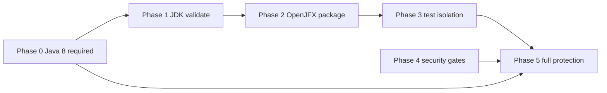

# Required checks roadmap

Staged path to make all Maven CI, JDK compatibility, test, and security
checks **required** on `develop` (and eventually `master`) without hiding
failures or requiring unstable gates prematurely.

**Tracker item:** `required-checks-roadmap` (HBTV-016)

**Scope of this document:** CI governance and documentation only. It does
not change application runtime behavior, Maven reactor topology, or JavaFX
packaging. OpenJFX migration and live-test isolation are prerequisite work
tracked separately (`javafx-modernization`, `provider-inventory`, risks
`javafx-jdk8`, `live-tests-flaky`).

**Related automation:** `.github/workflows/ci-maven.yml` (`Maven CI`),
`.github/workflows/ci.yml` (`CI`), `.github/dependabot.yml`

---

## Warning — stability before requirement

Required checks must be **stable**, **deterministic**, and **actionable**.

Do **not** add a check to branch protection when it:

- Depends on live provider websites, replay endpoints, or other external
  network behavior that the project does not control.
- Fails for reasons contributors cannot fix in the PR (for example missing
  OpenJFX on Java 11+ before migration work lands).
- Produces noisy security alerts without a documented remediation path.

Non-blocking jobs must remain visible (no `continue-on-error` used to hide
required work; diagnostic jobs may use `continue-on-error` only while they
are explicitly **not** required).

---

## Phase 0 — Current required baseline

**Goal:** Keep merge-blocking checks limited to the Java 8 baseline that
already works in CI (Liberica JDK 8 with bundled JavaFX).

### Required (target for `develop` ruleset)

| Check context | Job | Command |
|---------------|-----|---------|
| `Maven CI / validate-java8` | `validate-java8` | `mvn -B -ntp -DskipTests validate` |
| `Maven CI / deterministic-tests-java8` | `deterministic-tests-java8` | `mvn -B -ntp -pl fwk/api,fwk/framework,application/core,plugins/plugin-tester -am test` |
| `Maven CI / compile-and-package-java8` | `compile-and-package-java8` | `mvn -B -ntp -DskipTests package` |

Until the repository ruleset is updated, `develop` may still list the legacy
`CI / validate (zulu-8)` check from `.github/workflows/ci.yml`. When
governance updates land (`branch-protection`), align required checks with the
three `Maven CI` jobs above and drop redundant legacy-only gates once
parity is confirmed.

### Not required yet

- `Maven CI / compatibility-java11` (and 17, 21, 25) — validation or package
  on modern JDKs
- `Maven CI / full-test-suite` — includes live provider/network tests
- Provider live tests (any job or profile hitting real endpoints)
- Broad dependency or static-analysis gates that are still noisy or lack
  owner remediation playbooks
- Deployment, release, or publish workflows

### Local parity

```bash
mvn -B -ntp -DskipTests validate
mvn -B -ntp -pl fwk/api,fwk/framework,application/core,plugins/plugin-tester -am test
mvn -B -ntp -DskipTests package
```

See also [`docs/ci.md`](ci.md).

---

## Phase 1 — Modern JDK validation

**Goal:** Prove the reactor resolves and validates on Temurin 11, 17, 21, and
25 without requiring JavaFX packaging on those runtimes yet.

**CI behavior (today):** `compatibility-java` matrix jobs run
`mvn -B -ntp -DskipTests validate` and a **non-blocking** package diagnostic.
Package steps stay diagnostic until Phase 2 succeeds.

**When stable, make required (validation only):**

| Check context | Scope |
|---------------|--------|
| `Maven CI / compatibility-java11` | `validate` only |
| `Maven CI / compatibility-java17` | `validate` only |
| `Maven CI / compatibility-java21` | `validate` only |
| `Maven CI / compatibility-java25` | `validate` only (optional / experimental) |

Name these checks clearly as **validation**, not package compatibility. Do
not mark Java 11/17/21/25 package jobs as required while OpenJFX migration is
incomplete.

**Prerequisites:** JAXB/module-path issues tracked under `jaxb-mismatch` must
not cause chronic false failures on `validate` for the modules in the default
reactor.

---

## Phase 2 — OpenJFX migration and modern package compatibility

**Goal:** Package GUI-related modules on a selected modern LTS JDK after
OpenJFX dependencies or Maven profiles replace `${jdk.home}` / `jfxrt.jar`
assumptions.

**Prerequisite tracker:** `javafx-modernization` (risk `javafx-jdk8`).

**Engineering milestones (follow-up PRs, not this roadmap PR):**

1. Add OpenJFX dependencies or JDK-version profiles for Java 11+.
2. Ensure `application/trayView` compiles and `mvn -DskipTests package`
   succeeds on the target LTS (prefer **Java 17** or **Java 21**).
3. Keep Java 8 compatibility until a separate ADR retires it.
4. Leave `application/habiTv-linux` and `application/habiTv-windows` out of
   required gates until explicitly brought into the reactor or replaced.

**Only after real package success on CI**, add required checks such as:

- `Maven CI / package-java17` (example name — align with workflow job names
  when introduced)
- Do **not** mark compatibility package matrix jobs as done in the tracker
  until OpenJFX packaging actually works in CI artifacts.

**Still not required:** experimental newest-JDK (25) package unless explicitly
adopted as a support target.

---

## Phase 3 — Test isolation

**Goal:** A deterministic default test suite suitable for required CI; live
provider behavior tested separately.

**Prerequisite trackers:** `provider-inventory`, risk `live-tests-flaky`.

**Engineering milestones (follow-up PRs):**

1. Split offline/deterministic tests from live provider tests.
2. Move network/provider tests behind an explicit Maven profile, e.g.
   `-Plive-tests` (name to match implementation PR).
3. Add local fixtures for provider HTML/API parsing where feasible.
4. Ensure default `mvn test` (no profile) is CI-safe and does not call live
   endpoints.
5. Retarget `full-test-suite` to run default deterministic tests when made
   required; keep `-Plive-tests` on `workflow_dispatch` / schedule only.

**When stable, make required:**

| Check context | Scope |
|---------------|--------|
| `Maven CI / full-test-suite` (or renamed `deterministic-full-tests`) | Default offline suite on Java 8 |

**Remain optional / non-required:**

- `-Plive-tests` or equivalent provider live jobs
- Weekly scheduled full legacy runs until live tests are quarantined

---

## Phase 4 — Security gates

**Goal:** Actionable security signal on every PR without mass dependency
upgrades.

**Current state:**

- Dependabot (`.github/dependabot.yml`) opens scoped Maven and GitHub Actions
  update PRs; major bumps ignored by policy.
- Dependency Review can run on PRs when enabled at the org/repo level.
- CodeQL is **not** yet configured; add it before requiring analysis.

**Policy (document before requiring):**

| Gate | Intended use |
|------|----------------|
| Dependency Review | Block PRs introducing **high** or **critical** vulnerabilities in changed dependencies once noise is low |
| Dependabot | Remediation via focused PRs; no mass-upgrade sweeps |
| CodeQL | Required only after custom queries or paths are tuned for Java 8 legacy code |

**Remediation rules:**

- Fix critical/high issues in **focused** PRs per component or CVE class.
- Do not mass-bump unrelated dependencies to green a dashboard.
- Document accepted residual risk in `docs/risk-register.md` when deferring.

**When stable, make required:** Dependency Review and CodeQL on `develop`
PRs, in addition to Phase 0–3 checks.

---

## Phase 5 — Final branch protection target

After Phases 0–4 prerequisites are met, the **target** required check set:

| Required | Notes |
|----------|--------|
| `Maven CI / validate-java8` | While Java 8 remains supported |
| `Maven CI / deterministic-tests-java8` | Or superseded by Phase 3 full deterministic suite |
| `Maven CI / compile-and-package-java8` | Java 8 package baseline |
| Modern JDK `validate` jobs | Phase 1 |
| Modern LTS **package** job(s) | Phase 2 — selected 17 and/or 21 only |
| Deterministic full test job | Phase 3 |
| Dependency Review | Phase 4 |
| CodeQL | Phase 4 |

| Optional / non-required | Notes |
|-------------------------|--------|
| Live provider tests (`-Plive-tests`) | Manual or scheduled only |
| `Maven CI / compatibility-java25` | Experimental newest JDK |
| Deploy / release / static publish workflows | Owner-triggered |
| Legacy `CI / validate (zulu-8)` | Remove when redundant with Maven CI |

Governance application is tracked under `branch-protection` and
`docs/repository-governance.md`.

---

## Phase dependency diagram



Phase 4 can proceed in parallel with Phases 1–3 once Dependency Review and
CodeQL configurations are stable; do not block Java 8 baseline work on
security dashboard cleanup.

---

## Follow-up PRs (implementation, not this doc PR)

1. OpenJFX support for modern JDK packaging (`javafx-modernization`).
2. Split offline tests from live provider tests (`provider-inventory`).
3. Provider fixtures for deterministic parsing tests.
4. Progressive hardening of Dependency Review severities and CodeQL setup.
5. Ruleset update to match Phase 0 required checks (`branch-protection`).
